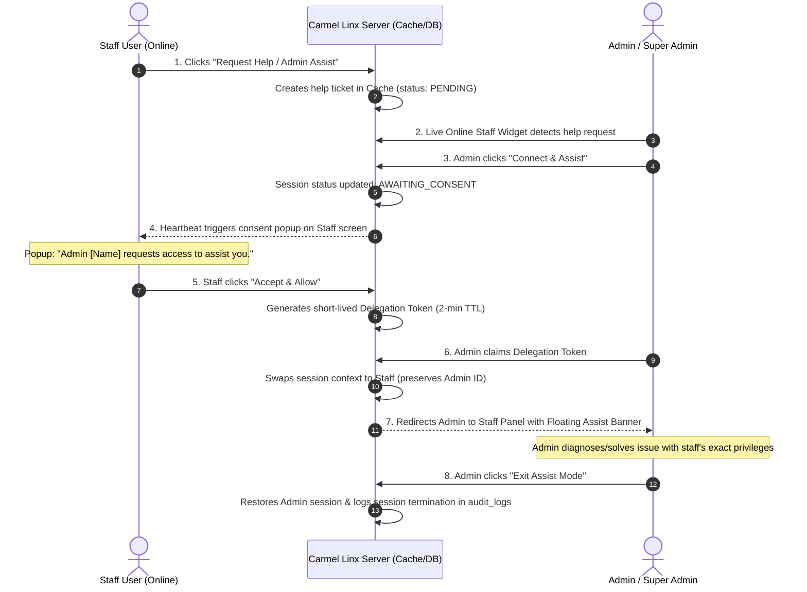

# Dual-Consent Staff Remote Assistance & Session Shadowing Plan

> **Status:** Approved Architecture Plan — Ready for Future Implementation  
> **Target Module:** Admin Control Desk, Live Online Staff Widget & Staff Dashboards  
> **Key Security Principle:** Zero Credential Sharing · Mandatory Staff Dual-Consent · Audit Log Traceability  

---

## 1. Overview & Objective

When an online staff member encounters an issue or requires administrative help:
1. Staff clicks a **"Request Admin Help"** button on their portal.
2. The Admin/Super Admin is notified in real time via the **Live Online Staff & Activity Monitor** on the Admin Control Desk.
3. The Admin initiates a remote assist connection.
4. An **[Accept & Allow]** confirmation modal appears on the staff member's screen.
5. Upon staff approval, the Admin's browser enters a **Delegated Session (Shadow Assist Mode)**, inheriting the exact rights, batch allocations, subjects, and views of the staff member without requiring or exposing passwords.
6. A persistent top banner allows the Admin to navigate and assist freely, and exit back to the Admin Desk with one click.

---

## 2. Sequence Diagram



---

## 3. Detailed Component Architecture

### Component A: Staff "Request Help" Trigger
* **Location**: Top bar or floating action button in:
  * `resources/views/staff_mobile_dashboard.blade.php`
  * `resources/views/lecturer_dashboard.blade.php`
  * `resources/views/hod_dashboard.blade.php`
* **Action**:
  * Button: `🆘 Request Admin Help`
  * Payload: `{ message: "Optional issue note", current_url: window.location.pathname }`
  * Endpoint: `POST /api/support/request-help`
  * Storage: Cache key `support_ticket_{mobile_no}` with status `'WAITING_FOR_ADMIN'`.

### Component B: Admin Notification in Live Staff Monitor
* **Location**: `resources/views/partials/live_online_staff_widget.blade.php` on `admin_control_desk.blade.php`.
* **Visual Alert**:
  * Live alert pill next to the staff member's row: `🆘 Help Requested (1m ago)`.
  * Action button: **[Connect & Assist]**.
* **Action**:
  * Calls `POST /api/support/initiate-session` with `{ staff_mobile: "..." }`.
  * Status updates to `'AWAITING_STAFF_CONSENT'`.

### Component C: Staff Dual-Consent Handshake
* **Trigger**:
  * Staff dashboard's heartbeat `/api/system/session-check` returns `{ pending_assist_request: true, admin_name: "Super Admin User" }`.
* **Consent Modal**:
  * Displays prominently on the staff member's browser:
    > **Administrative Remote Support Request**  
    > **Super Admin User (9000000000)** is requesting permission to view and access your dashboard session to help you.  
    > *Note: Admin will see your batches, marks, and attendance. Session auto-expires in 15 mins.*  
    > `[ Decline ]` | `[ Accept & Allow Session ]`
* **Response**:
  * If **Decline**: Sets status to `'DECLINED'` and notifies admin.
  * If **Accept & Allow**:
    * Calls `POST /api/support/consent-response` with `{ accepted: true }`.
    * Generates a single-use Delegation Token (e.g., `del_tok_...`, 2-min TTL) in Cache.

### Component D: Non-Destructive Session Delegation (Shadow Mode)
* **Endpoint**: `GET /api/support/launch-shadow-session?token={delegationToken}`
* **Logic**:
  ```php
  // 1. Back up genuine admin identity
  session([
      'impersonator_id'   => session('userId'),
      'impersonator_name' => session('userName'),
      'impersonator_role' => session('userRole'),
      'assist_session_id' => $sessionId,
      'assist_expires_at' => now()->addMinutes(15)->timestamp,
  ]);

  // 2. Load target staff profile
  $staff = StaffProfile::where('mobile_no', $targetMobile)->firstOrFail();

  // 3. Adopt staff session context
  session([
      'userId'     => $staff->mobile_no,
      'userName'   => $staff->name,
      'userRole'   => $staff->designation,
      'userBranch' => $staff->branch,
      'userEmail'  => $staff->email,
      'userPhoto'  => $staff->photo_url,
  ]);
  ```
* **Result**:
  * Admin is redirected to the staff's home panel (`/dashboard/lecturer`, `/dashboard/hod`, etc.).
  * Every query and permission check in the portal scopes naturally to the staff member's mobile and department.

### Component E: Floating Assist Banner & One-Click Exit
* **Location**: Fixed top banner rendered in layouts whenever `session()->has('impersonator_id')`.
* **UI**:
  ```html
  <div class="fixed top-0 inset-x-0 z-50 bg-amber-600 text-white px-4 py-2 flex items-center justify-between text-xs font-bold shadow-lg">
    <span>⚠️ SUPPORT ASSIST MODE: Viewing as SURYA V (Lecturer · CT) | Real User: Super Admin</span>
    <button onclick="exitAssistMode()" class="px-3 py-1 bg-white text-amber-900 rounded-lg hover:bg-amber-100 font-black">
      Exit Assist Mode
    </button>
  </div>
  ```
* **Exit Action**:
  * Calls `POST /api/support/exit-shadow-session`.
  * Restores `userId`, `userName`, `userRole` back to the saved `impersonator_*` values.
  * Cleans up session keys.
  * Redirects Admin back to `/dashboard/superadmin` or `/dashboard/admin`.

### Component F: Audit Trail Compliance
* Every shadow session writes to `audit_logs`:
  * **On Start**: `action = "Support Assist Session Started"`, `performed_by = Admin Mobile`, `target_id = Staff Mobile`.
  * **On End**: `action = "Support Assist Session Ended"`, recording duration and time.
  * **Actions Performed During Assist**: Automatically tagged with `performed_by_name = "[Staff Name] (via Admin [Admin Name])"`.

---

## 4. Security & Privacy Safeguards

| Protection Layer | Implementation Mechanism |
| :--- | :--- |
| **No Password Sharing** | Staff passwords are never requested, stored, decrypted, or modified. |
| **Mandatory Staff Consent** | Admins cannot silently hijack sessions; staff must click **Accept & Allow**. |
| **15-Minute Auto-Expiry** | Session automatically invalidates after 15 minutes to prevent session lingering. |
| **Single-Use Tokens** | Delegation tokens expire after 2 minutes or immediately upon single redemption. |
| **Role Gate** | Only `Super_Admin`, `Principal`, and `Admin` can claim assist tokens. |
| **Immutable Audit Record** | MySQL `audit_logs` records every assist event with IP, timestamp, and target. |

---

## 5. Files to Touch When Implementing

1. **Backend**:
   * `app/Http/Controllers/SupportDeskController.php` (Implement assist request, consent, token exchange, and exit handlers)
   * `routes/web.php` (Register `/api/support/*` assist endpoints)
2. **Frontend Admin**:
   * `resources/views/partials/live_online_staff_widget.blade.php` (Add Help Requested pill & Connect & Assist button)
3. **Frontend Staff**:
   * `resources/views/partials/staff_profile_panel.blade.php` / staff dashboards (Add "Request Help" button & Consent popup modal)
4. **Layout**:
   * Add global Assist banner partial (`resources/views/partials/shadow_assist_banner.blade.php`) included in dashboard templates.
